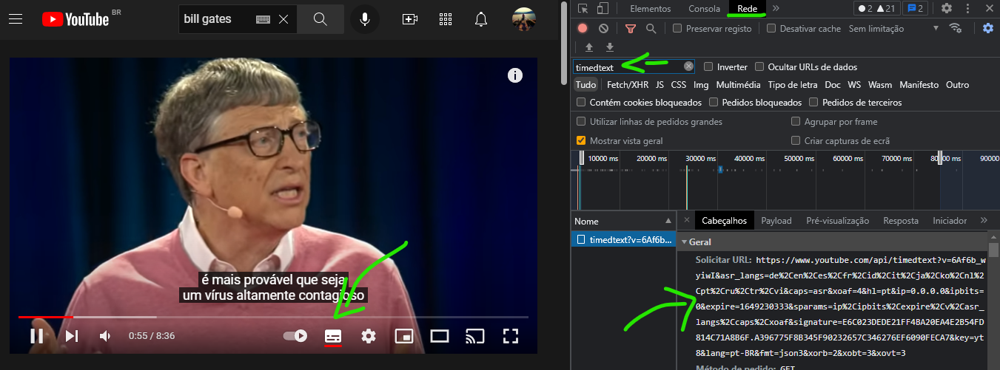

# Capturar as legendas automãticas do YouTube

Para capturar as legendas, você precisará do link TIMEDTEXT, que pode ser obtido da seguinte forma:

1. clique com o botão direito na página do vídeo desejado, selecione INSPECIONAR;
2. clique na aba REDE (ou NETWORK, se estiver em inglês);
3. se a propriedade timedtext não estiver aparecendo, clique no botão de legendas do vídeo do youtube, para fazer ele carregar o link;
4. assim que visualizar, clique em timedtext, e ele abrirá o link à direita;
5. copie o valor do link, e utilize-o no script.

Teste aqui:
[https://annasoldih.github.io/youtube_captions/](https://annasoldih.github.io/youtube_captions/)
